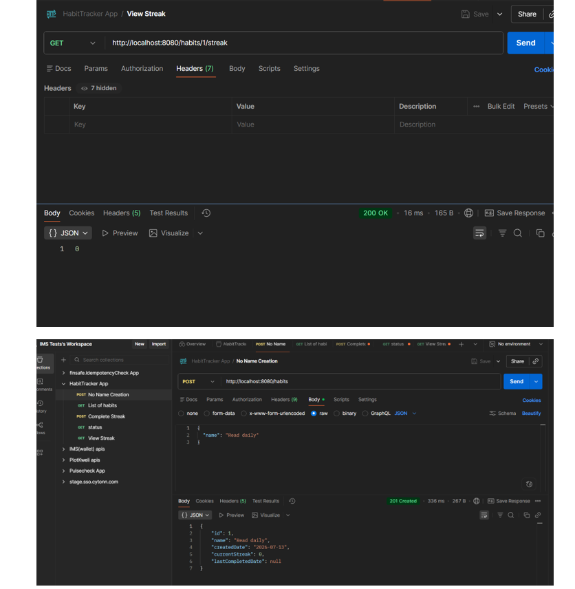
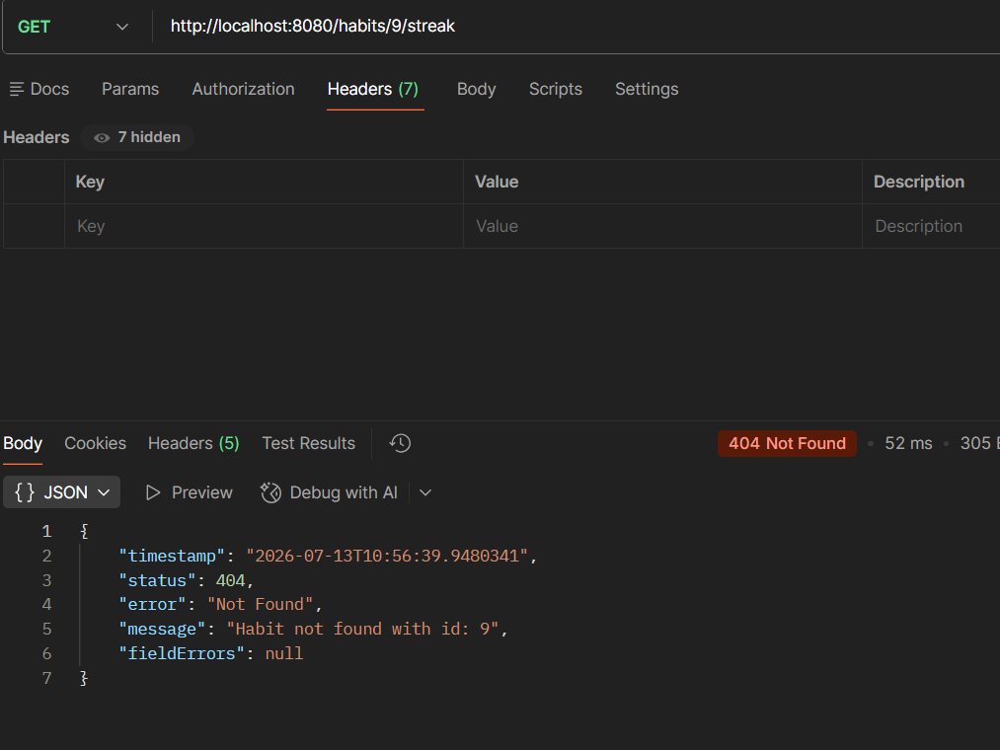
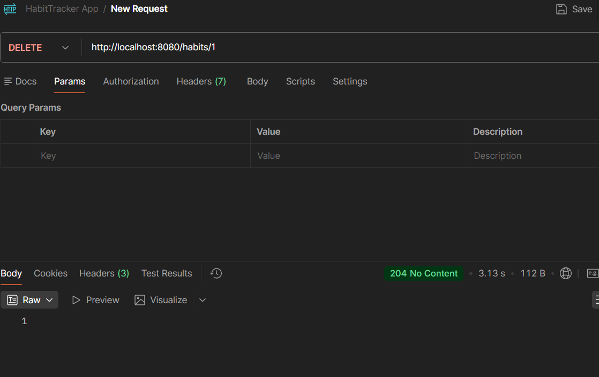
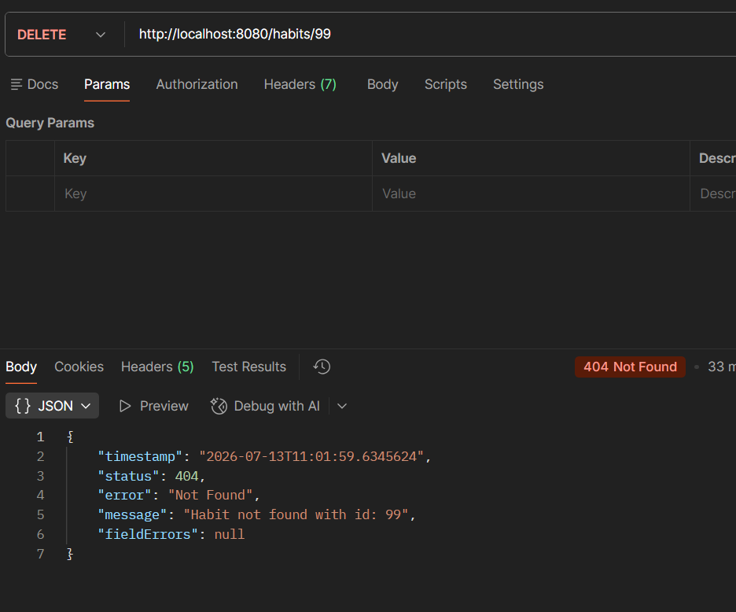
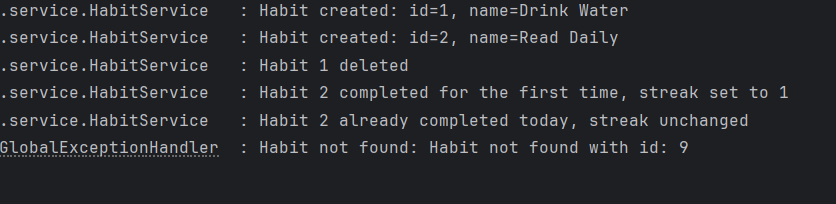

# Sprint 2 Review

## Stories Delivered
- Story 3: View streak
- Story 5: Delete a habit
- Story 6: Health check (Actuator endpoint, verified working)
- Monitoring: console logging added for habit lifecycle events and errors

## Improvements Applied from Sprint 1 Retrospective
- Committed in smaller, more frequent increments this sprint, code and evidence kept as separate commits
- Reused the working CI pipeline directly without needing to debug it again
- Planned each story's logic in plain English before writing code, following the same case-by-case reasoning used for the streak logic in Sprint 1

## Evidence

### View Streak (GET /habits/{id}/streak)
Returns 200 with the current streak count.

Returns 404 when the habit does not exist.

### Delete Habit (DELETE /habits/{id})
Returns 204 on successful deletion.

Returns 404 when the habit does not exist.

### Logging
Console logs confirmed for habit creation, completion (all streak branches), deletion, and error cases (not found, validation failure).

## Testing
4 new unit tests added to HabitServiceTest, covering:
- Get streak: habit exists
- Get streak: habit not found
- Delete habit: habit exists
- Delete habit: habit not found

All 10 tests passing (6 from Sprint 1, 4 new).

## CI/CD
Existing GitHub Actions pipeline ran automatically on all Sprint 2 pushes, remained green throughout, no reconfiguration needed.